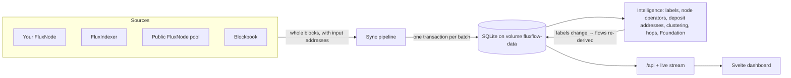

# FluxFlow

**Who is moving FLUX on and off exchanges.** FluxFlow reads every block of the Flux chain,
recognises exchange, node-operator and Flux Foundation wallets, and shows the buying and
selling pressure that results: how much, through which exchange, by which kind of wallet, and
who the biggest movers are.

It runs as one container on one port, keeps its data in one SQLite file on a Docker volume,
and can read the chain from your own FluxNode.

- [What it shows](#what-it-shows)
- [Quick start](#quick-start)
- [Configuration](#configuration)
- [Updating, backups and your data](#updating-backups-and-your-data)
- [How it works](#how-it-works)
- [Address intelligence](#address-intelligence)
- [API](#api)
- [Config files: labels and alerts](#config-files-labels-and-alerts)
- [Development](#development)
- [Troubleshooting](#troubleshooting)
- [Project structure](#project-structure)

---

## What it shows

| Page                   | What you get                                                                                                                                                                                                                                                                                                          |
| ---------------------- | --------------------------------------------------------------------------------------------------------------------------------------------------------------------------------------------------------------------------------------------------------------------------------------------------------------------- |
| **Dashboard** `/`      | The net balance for the period (more FLUX onto exchanges than off, or the other way round), the top sellers and buyers, the split by exchange and by kind of wallet, net flow over time, exchange hops, every transfer (filterable, CSV export) and your watchlist. The period is in the URL, so links can be shared. |
| **Wallet** `/wallet/…` | One address: what it moved to and from each exchange, when, its transfers, and **why it is labelled** the way it is (source, confidence and evidence).                                                                                                                                                                |
| **Foundation**         | Every Flux Foundation wallet, balances, inflow and outflow, and **where the money went next**: exchanges, node collateral, still held.                                                                                                                                                                                |
| **Search**             | Address (or prefix), label name or transaction id.                                                                                                                                                                                                                                                                    |
| **Label review**       | Admin page to accept or reject detected exchange addresses in bulk, with the evidence beside each one.                                                                                                                                                                                                                |

Periods: **24 hours, 7 days, 30 days, 90 days, 6 months**. Each is resolved from block
_time_, so "24 hours" is the last 24 hours of the chain, not a fixed number of blocks.

A status bar on every page shows whether the data is live, which source it comes from, and,
on a fresh install, a **Catching up** banner with progress, the date the data reaches so far,
and an estimate of the time left.

**Example.** On a 7-day window FluxFlow reports something like:

> More FLUX went onto exchanges than came off them: **475,178 deposited**, 156,183 withdrawn,
> net **−318,995**. Kucoin took 382,472 of the deposits, and node operators sold 11,198.
> The top seller deposited 199,000 FLUX to Kucoin in one transfer, 42% of all selling.

---

## Quick start

You need a Linux host (or any machine) with **Docker** and **Docker Compose v2**.

```bash
git clone https://github.com/2ndtlmining/fluxflow.git
cd fluxflow
cp .env.example.compose .env
openssl rand -hex 32          # paste the output into ADMIN_TOKEN= in .env
deploy/redeploy.sh
```

Open `http://<server>:3000` (or the `PORT` you set).

The first start syncs **six months** of history, **oldest first, forward to today**. While it
does, the figures move with every batch and a banner says how far it has got. From your own
node on the LAN this took about 35 minutes (13,000–15,000 blocks a minute); from the public
FluxNode pool expect longer. Once caught up the banner disappears and new blocks arrive about
every 30 seconds.

### Mandatory and recommended variables

| Variable        | Required?   | Example                       | Why                                                                                                                                          |
| --------------- | ----------- | ----------------------------- | -------------------------------------------------------------------------------------------------------------------------------------------- |
| `ADMIN_TOKEN`   | **Yes**     | `openssl rand -hex 32` output | Guards the admin endpoints and the Label review page. Production refuses to start without it; at least 32 characters.                        |
| `FLUX_NODE_URL` | Recommended | `http://192.168.1.50:16127`   | Your own FluxNode's FluxOS API, used first. Fast, trusted, never rate-limited. The node needs the spent/address index (`insightexplorer=1`). |
| `PORT`          | No (`3000`) | `3999`                        | Host port for the dashboard and API.                                                                                                         |

That is all most installs need. Without `FLUX_NODE_URL`, FluxFlow reads from the public
FluxNode network instead, which also works, just more slowly.

---

## Configuration

Everything comes from environment variables (`.env` with Docker Compose), validated once at
startup. An invalid value stops the boot and lists every problem at once. The annotated
schema is [`src/lib/server/config.ts`](src/lib/server/config.ts); every variable is in
[`.env.example`](.env.example).

### Where the chain data comes from

Sources are tried in this order; a failing one is skipped by a circuit breaker and
health-probed until it recovers.

| Order | Source                   | Set with                                | Notes                                                                                                                                                                                                  |
| ----- | ------------------------ | --------------------------------------- | ------------------------------------------------------------------------------------------------------------------------------------------------------------------------------------------------------ |
| 1     | **Your own FluxNode**    | `FLUX_NODE_URL`                         | Trusted, usually on your LAN. One request returns a whole block with every input's address.                                                                                                            |
| 2     | Your own FluxIndexer     | `FLUX_INDEXER_URL`                      | Optional.                                                                                                                                                                                              |
| 3     | **Public FluxNode pool** | on by default (`FLUXNODE_POOL_ENABLED`) | Discovers nodes from the public explorer, keeps the fastest ~15 that have the spent index, two requests in flight per node, tip agreed by median, every 25th block cross-checked against another node. |
| 4     | Blockbook                | `BLOCKBOOK_URL`                         | Last resort. Rate-limited per IP, so not suitable for a full sync.                                                                                                                                     |

### Commonly changed

| Variable                                      | Default     | Effect                                                                    |
| --------------------------------------------- | ----------- | ------------------------------------------------------------------------- |
| `RETENTION_DAYS`                              | `180`       | Detailed history kept. Totals (rollups) are kept beyond it.               |
| `SYNC_POLL_SECONDS`                           | `30`        | How often to look for new blocks once caught up.                          |
| `SYNC_BATCH_SIZE`                             | `250`       | Blocks per committed batch.                                               |
| `SYNC_CONCURRENCY`                            | `16`        | Blocks fetched in parallel.                                               |
| `LOG_LEVEL`                                   | `info`      | `debug` for detail.                                                       |
| `TRUST_PROXY`                                 | `0`         | Set `1` behind your own reverse proxy so rate limits see real client IPs. |
| `ORIGIN`                                      | unset       | Allow one cross-origin client (CORS). Unset means same-origin only.       |
| `API_RATE_LIMIT_RPS` / `API_RATE_LIMIT_BURST` | `10` / `60` | Per-IP API rate limit; `0` disables.                                      |
| `LIVE_FLOW_MIN_FLUX`                          | `1000`      | Smallest new flow pushed live to open browsers.                           |
| `INTEL_ENABLED`                               | `1`         | Node-operator detection, clustering, hops and Foundation tracing.         |
| `NODE_REFRESH_SECONDS`                        | `600`       | How often the node list (and node-operator labels) is refreshed.          |
| `INTEL_CLUSTER_SECONDS`                       | `1800`      | How often clustering and deposit-address detection run.                   |

Pool tuning (`FLUXNODE_POOL_SIZE`, `FLUXNODE_MAX_INFLIGHT`, `FLUXNODE_API_PORTS`, …) and
HTTP timeouts are documented in `.env.example`. With Docker Compose, `NODE_ENV`, `PORT`
inside the container, `DATABASE_PATH` and `LABELS_PATH` are fixed in
`docker-compose.yml`; don't set them in `.env`.

---

## Updating, backups and your data

### Updating

```bash
deploy/redeploy.sh
```

That one command checks `.env` and `ADMIN_TOKEN`, runs `git pull --ff-only`, **backs up the
database** from the running container (SQLite online backup, safe while it writes), builds
an image tagged with the git SHA, starts it, waits for it to be healthy, and checks that the
new version is the one answering. Schema migrations run automatically at startup and only
move forward.

| Knob               | Default | Effect                                                      |
| ------------------ | ------- | ----------------------------------------------------------- |
| `SKIP_PULL=1`      | off     | Deploy the checkout as it is                                |
| `BACKUP_KEEP`      | `3`     | Backups kept inside the volume                              |
| `BACKUP_DIR=/path` | unset   | Also copy each backup to this host directory                |
| `SKIP_BACKUP=1`    | off     | Allow a deploy when data exists but no container is running |
| `HEALTH_TIMEOUT`   | `900`   | Seconds to wait for healthy                                 |

### Your data survives updates

| What               | Where                                                                 |
| ------------------ | --------------------------------------------------------------------- |
| Database           | Docker volume **`fluxflow-data`** → `/app/data/flux-flow.db`          |
| Pre-deploy backups | same volume → `/app/data/backups/` (the newest `BACKUP_KEEP`)         |
| Address labels     | `./config/labels.json`, mounted read-only; edits apply within seconds |
| Settings           | `.env`, never committed and never copied into the image               |

The volume name is fixed, so it doesn't depend on the folder you cloned into. Rebuilds,
updates, `docker compose down` and `restart` all keep it. **Only `docker compose down -v` or
`docker volume rm fluxflow-data` deletes your data.** Check it with
`docker volume inspect fluxflow-data`.

### Rolling back

Every build keeps its own `fluxflow:<sha>` image, and the script prints the exact command:

```bash
GIT_SHA=<previous sha> docker compose up -d --no-build
```

Rolling back across a schema migration also needs the matching backup restored:

```bash
docker compose cp fluxflow:/app/data/backups ./backups      # copy backups to the host
docker compose stop
docker run --rm -v fluxflow-data:/data -v "$PWD/backups:/b" alpine \
  sh -c 'rm -f /data/flux-flow.db-wal /data/flux-flow.db-shm && cp /b/<backup>.db /data/flux-flow.db && chown 1000:1000 /data/flux-flow.db'
docker compose start
```

### Day to day

```bash
docker compose ps                    # health
docker compose logs -f               # structured JSON logs
curl -s localhost:3000/api/status    # sync progress, data sources, labels
```

---

## How it works



One Node.js process serves the API, the web app and the live event stream on one port.

### Sync pipeline

- **Whole blocks in one request.** A FluxNode's `getblockdeltas` returns every transaction
  of a block with each input's address and amount. v1 needed one request per transaction
  against a rate-limited public API, capped at 50 per block.
- **Back to back while behind.** Batches of `SYNC_BATCH_SIZE` blocks are fetched
  `SYNC_CONCURRENCY` at a time and committed one after another until the tip is reached;
  the 30-second poll only applies once caught up. (The first v2 build ran one batch per
  poll: about 17 hours for six months. Now it is under an hour from a LAN node.)
- **All or nothing.** Everything derived from a batch (blocks, per-address deltas, flows,
  node rewards) commits in one SQLite transaction, so a crash never leaves a block marked
  done with its flows missing. A height that fails is recorded and retried, never skipped.
- **Reorgs.** The last stored hashes are compared with the chain every cycle; a mismatch
  rolls back and re-syncs.
- **Retention.** Raw rows older than `RETENTION_DAYS` are pruned; the totals are kept.

### From transactions to flows

For each transfer, FluxFlow nets every address's inputs against its outputs, so change and
self-transfers cancel out. Each recipient's amount is then **split across all the funders in
proportion to what they put in**. A sweep of ten exchange deposit addresses becomes ten
rows, each credited with its own share, not one row credited to whichever address came
first. The split is exact to the satoshi.

Each row is classified from the labels of the two sides:

| From          | To          | Flow        |
| ------------- | ----------- | ----------- |
| an exchange   | anyone else | **buying**  |
| anyone else   | an exchange | **selling** |
| anything else |             | p2p         |

Transfers between Foundation wallets produce no flow at all.

### Data model

| Table                                                                    | Role                                                              |
| ------------------------------------------------------------------------ | ----------------------------------------------------------------- |
| `blocks`                                                                 | height, hash, time, and which source it came from                 |
| `tx_deltas`                                                              | per-transaction, per-address satoshi in/out: the immutable facts  |
| `node_rewards`                                                           | who received block rewards, so "was a node operator" has a date   |
| `address_labels`                                                         | labels with a **source**, **confidence** and **evidence**         |
| `flows`                                                                  | the derived buying / selling / p2p rows                           |
| `rollup_*`, `wallet_*`                                                   | hourly/daily totals and per-wallet totals, kept exact by triggers |
| `label_candidates`, `exchange_hops`, `address_clusters`, `relabel_queue` | intelligence state                                                |

Facts are never rewritten. When a label changes, the affected transactions are re-derived
from `tx_deltas` in small batches, and the triggers move the totals in the same write, so
the dashboard always matches the current labels.

### Speed

Every API answer is cached per data version (it only changes when a batch commits) and
carries an `ETag`, so repeat requests are answered from memory or with `304`. Totals come
from the rollups: a 6-month summary reads a few hundred daily buckets instead of millions
of rows.

---

## Address intelligence

Every label has a **source**, a **confidence** and its **evidence**. Only labels at
**likely** (0.7) or above change how a flow is counted; weaker ones are shown on the wallet
page with their evidence and nowhere else. A manual label always wins.

| Kind                     | How it is found                                                                                                                                                                           | Confidence         |
| ------------------------ | ----------------------------------------------------------------------------------------------------------------------------------------------------------------------------------------- | ------------------ |
| Exchange                 | `config/labels.json`, or a candidate accepted on the Label review page                                                                                                                    | confirmed          |
| Exchange deposit address | **Forwarder:** an unlabelled address that sends every outflow to one exchange (5+ times), passes on what it receives and never withdrew from an exchange. 2–4 times → proposed for review | likely / candidate |
| Exchange (candidate)     | **Clustering:** addresses spent together with a known exchange address. **Sweeps:** addresses consolidated into a known hot wallet                                                        | candidate          |
| Foundation               | `config/labels.json`, with named sub-wallets                                                                                                                                              | confirmed          |
| Foundation intermediary  | A wallet funded ≥95% by the Foundation that passes it on (not more than it received) almost entirely to **confirmed** nodes or as live node collateral                                    | likely             |
| Node operator            | Payment address on the current node list                                                                                                                                                  | confirmed          |
| Node operator            | Received block rewards in stored blocks but is no longer listed (valid 30 days after its last reward)                                                                                     | likely             |
| Node operator's wallet   | **Reward forwarding:** ≥90% of its inflow from node operators (≥100 FLUX), nothing bought on an exchange; followed **two wallets deep** (node → W1 → W2)                                  | likely / possible  |
| Node operator's wallet   | **Node funding:** sends ≥90% of its outflow (at least one collateral, 1,000 FLUX) to node addresses, e.g. buying FLUX to stand nodes up                                                   | likely             |
| Unknown                  | everything else                                                                                                                                                                           | –                  |

What this means in practice:

- **Node operators who sell through their own wallets are counted as node operators.**
  Node → own wallet → Kucoin shows as node-operator selling, as does node → Kucoin deposit
  address.
- **Sales are credited to the person who deposited**, at the time they deposited, once the
  deposit address is known, not to the deposit address when the exchange sweeps it hours
  later.
- **Exchange hops** (a withdrawal from one exchange re-deposited to another by the same
  wallet within ~2 hours) are listed separately, and headline totals can be read without
  them.
- **Foundation money is followed up to three wallets forward** and summarised as exchange
  (by name), node collateral (verified against the node list), returned, or still held.
  Payments through a Foundation intermediary count as the Foundation's own outflow to their
  real destinations.

---

## API

All endpoints are same-origin JSON under `/api`. Full request and response shapes are in
[`docs/api.md`](docs/api.md).

```bash
curl -s localhost:3000/api/health
# {"status":"ok","version":"e3c9c34","uptimeSeconds":446,"lastSuccessfulSyncAt":1791103224883}

curl -s localhost:3000/api/flow/7D | jq '{netFlow, buying: .buying.total, selling: .selling.total}'
# {"netFlow": -318994.68, "buying": 156183.23, "selling": 475177.91}

curl -s 'localhost:3000/api/flow/7D/sellers?limit=1' | jq '.sellers[0] | {address, kind, total, share, exchanges}'
# {"address":"t1Tohzrk8n…","kind":"unknown","total":199000,"share":0.419,
#  "exchanges":[{"name":"Kucoin","total":199000,"count":1}]}

curl -s localhost:3000/api/status | jq .sync.catchUp
# {"tip":3007084,"behindBlocks":318178,"catchingUp":true,"progress":38.6,
#  "dataFrom":1775524774,"dataAsOf":1781543554,"etaSeconds":1391}
```

| Method | Path                                                                                             | What                                                                  |
| ------ | ------------------------------------------------------------------------------------------------ | --------------------------------------------------------------------- |
| GET    | `/api/health`                                                                                    | Liveness; `503` + `degraded` when sync is stale                       |
| GET    | `/api/status`                                                                                    | Sync and catch-up progress, ingest stats, data sources, labels        |
| GET    | `/api/flow/:period`                                                                              | Totals, by exchange and by kind of wallet; previous period            |
| GET    | `/api/flow/:period/sellers` / `buyers`                                                           | Leaderboards (`limit`, `kind`, `minConfidence`)                       |
| GET    | `/api/flow/:period/series`                                                                       | Buying / selling / net per hour (≤ 7 days) or per day                 |
| GET    | `/api/flow/:period/events`                                                                       | Every transfer, keyset-paginated and filterable                       |
| GET    | `/api/flow/:period/hops`                                                                         | Exchange hops                                                         |
| GET    | `/api/wallets/:address`                                                                          | Wallet profile, labels with evidence, exchanges, history              |
| GET    | `/api/wallets/:address/events`                                                                   | A wallet's transfers, paginated                                       |
| GET    | `/api/search?q=`                                                                                 | Address prefix, label name or txid                                    |
| GET    | `/api/foundation?period=`                                                                        | Foundation wallets, totals, balance history, destinations             |
| GET    | `/api/intel/status`                                                                              | Labels by source, node list, clustering, intermediaries               |
| GET    | `/api/stream`                                                                                    | Server-Sent Events: `sync` after each batch, `flow` for new big flows |
| GET    | `/api/metrics`                                                                                   | Prometheus metrics                                                    |
| GET    | `/api/admin/labels/review`                                                                       | Admin: candidates with evidence, for the review page                  |
| POST   | `/api/admin/labels/candidates/decide-bulk`                                                       | Admin: accept or reject many candidates in one go                     |
| POST   | `/api/admin/labels` · DELETE `/api/admin/labels/:address`                                        | Admin: set or remove a manual label                                   |
| POST   | `/api/admin/sync` · `/api/admin/intel/run` · `/api/admin/retention` · `/api/admin/alerts/reload` | Admin: run a job now                                                  |

`period` is `24H`, `7D`, `30D`, `90D` or `6M`. Admin endpoints need
`Authorization: Bearer $ADMIN_TOKEN`. Every parameter is validated (a bad value is a `400`
naming it), clients are rate limited per IP, and bodies over 64 KB are refused.
`/api/blocks/status`, `/api/database/stats`, `/api/classification/stats` and
`/api/unknowns/stats` remain for v1 clients.

Live updates in the browser:

```js
const events = new EventSource('/api/stream');
events.addEventListener('sync', (e) => refresh(JSON.parse(e.data))); // after each batch
events.addEventListener('flow', (e) => toast(JSON.parse(e.data))); // a new flow ≥ LIVE_FLOW_MIN_FLUX
```

---

## Config files: labels and alerts

### Address labels (`config/labels.json`)

```json
{
  "exchanges": [{ "name": "Kucoin", "addresses": ["t1...", "t1..."] }],
  "foundation": {
    "name": "Flux Foundation",
    "addresses": ["t1..."],
    "wallets": [{ "name": "Treasury", "addresses": ["t3..."] }]
  }
}
```

The file is watched: an edit applies within seconds, without a restart, and the affected
flows are re-derived. Removing an address removes its label.

### Reviewing detected exchange addresses

Open **Label review** (linked in the footer, `/review`), enter `ADMIN_TOKEN` once per
browser tab, and accept or reject whole groups (one exchange, one method) with the evidence
beside each address. Accepting re-derives the affected transfers; rejecting undoes it. The
same with curl:

```bash
curl -H "Authorization: Bearer $ADMIN_TOKEN" 'localhost:3000/api/admin/labels/review?status=pending'
curl -H "Authorization: Bearer $ADMIN_TOKEN" -H 'content-type: application/json' \
  -d '{"address":"t1...","kind":"exchange","name":"Kucoin","decision":"accepted"}' \
  localhost:3000/api/admin/labels/candidates/decide
```

### Alerts (`config/alerts.json`)

Whale and watchlist alerts to Discord, Telegram or any webhook. Copy
[`config/alerts.example.json`](config/alerts.example.json) to `config/alerts.json`; without
the file, alerts are off.

```json
{
  "channels": { "discord": { "type": "discord", "url": "env:DISCORD_WEBHOOK_URL" } },
  "rules": [
    {
      "name": "Whale sell to an exchange",
      "minFlux": 25000,
      "flowTypes": ["selling"],
      "channels": ["discord"],
      "cooldownSeconds": 300
    }
  ]
}
```

Then put `DISCORD_WEBHOOK_URL=…` in `.env`. Rules can match on `minFlux`, `flowTypes`,
`exchanges`, `kinds` (e.g. `node_operator`) and `addresses`. Secrets are referenced as
`env:NAME` so they stay out of the file. Each flow alerts once per rule, with a cooldown and
at most 5 alerts per batch; history being synced never alerts. The file is re-read when it
changes.

---

## Development

```bash
npm install
cp .env.example .env         # LOG_PRETTY=1 for readable logs; FLUX_NODE_URL to sync fast
npm run dev                  # API on :3000 + Vite on :5173, both watching
```

Open <http://localhost:5173>. To work on the UI against a server that already has data:

```bash
API_PROXY_TARGET=http://<server>:3000 npm run dev:web
```

Checks (all run in CI on Node 22):

```bash
npm run verify               # format check + lint + server typecheck + tests
npm run check                # svelte-check
npm run build:all            # vite build → build/, tsc → dist/
npx tsx scripts/bench-api.ts # API benchmark on a synthetic 6-month database
```

**Windows:** `better-sqlite3` needs a C++ toolchain to install. Without Visual Studio Build
Tools, run the commands in Docker instead:

```bash
docker run --rm -v "$PWD":/app -v fluxflow-nm:/app/node_modules -w /app node:22-bookworm \
  bash -c "npm ci && npx svelte-kit sync && npm run verify"
```

---

## Troubleshooting

**The numbers keep jumping.** It is still catching up: the banner says how far, and up to
which date the figures reach. They settle once it reaches today.

**Sync is slow or stalls.** Check which source is active:

```bash
curl -s localhost:3000/api/status | jq '.dataSources.active, .dataSources.details'
```

`blockbook` means the better sources are failing; Blockbook rate-limits by IP. Set
`FLUX_NODE_URL` to your own node. For the pool, `insight: 0` means no discovered node has
the spent index; raise `FLUXNODE_PROBE_SAMPLE` or check `FLUXNODE_API_PORTS`.

**`FLUX_NODE_URL` is set but not used.** The node must be reachable from the container on
its FluxOS API port (usually `16127`) and have the spent index enabled. If not, it reports
unhealthy and the pool takes over; `/api/status` → `dataSources.sources` shows its state.

**`/api/health` returns 503.** No sync cycle has succeeded recently; the `reason` field says
why. Look at `/api/status` and the logs:

```bash
docker compose logs fluxflow | grep -E '"level":(40|50)'
```

**The container won't start.** `ADMIN_TOKEN` must be set and at least 32 characters. Any
other configuration error is listed in full in the log at startup.

**A wallet is labelled wrongly.** The wallet page shows the label's source and evidence.
Correct it with a manual label (`POST /api/admin/labels`, or `"kind": "unknown"` to remove
one), or fix `config/labels.json`.

---

## Project structure

```
src/
├── server.ts                     # entry: /api router + SvelteKit handler, one process
├── routes/                       # pages: /, /wallet/[address], /foundation, /search, /review
└── lib/
    ├── ui/                       # Svelte 5 components
    ├── client/                   # browser-only: API client, live stream, formatting, CSV
    ├── shared/                   # code safe on both sides
    └── server/                   # stripped from the client bundle
        ├── config.ts             # zod-validated environment
        ├── http.ts               # every outbound call: timeout, retries, limiter
        ├── labels.ts             # label book: sources, priorities, confidence
        ├── db/                   # SQLite connection, versioned migrations
        ├── ingest/               # sync loop, block → flows derivation, writer, data sources
        ├── intel/                # node operators, deposit forwarders, clustering, hops,
        │                         #   Foundation intermediaries and destinations, re-derivation
        ├── api/                  # router, queries, caching, catch-up state
        └── live/                 # event stream and alerts
config/labels.json                # address labels, mounted into the container
deploy/redeploy.sh                # pull, back up, build, verify
docs/api.md · docs/adr/           # API reference, architecture decisions
```

Design decisions are recorded in [`docs/adr/`](docs/adr/).

## Credits

Built on the Flux ecosystem: FluxOS daemon APIs on FluxNodes,
[explorer.runonflux.io](https://explorer.runonflux.io) and
[blockbook.runonflux.io](https://blockbook.runonflux.io). Inspired by
[Fluxtracker](https://fluxtracker.app.runonflux.io).

## License

MIT.
